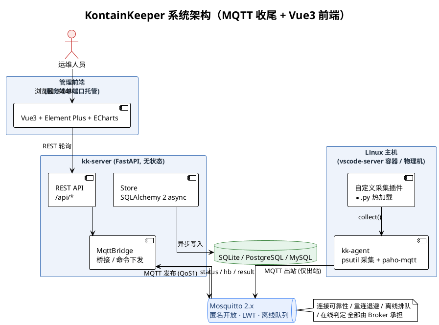

<div align="center">

# KontainKeeper

Linux 主机（典型形态：K8S 下的 vscode-server 容器 IDE）的**直连管理与指标提取平台**

[](https://github.com/taoweidong/KontainKeeper/blob/main/LICENSE)
[](https://github.com/taoweidong/KontainKeeper/stargazers)
[](https://github.com/taoweidong/KontainKeeper/network/members)
[](https://github.com/taoweidong/KontainKeeper/issues)
[](https://www.python.org/downloads/)
[](https://fastapi.tiangolo.com/)
[](https://mosquitto.org/)
[](https://vuejs.org/)
[](https://www.sqlalchemy.org/)
[](https://github.com/astral-sh/uv)
[](https://www.docker.com/)

</div>

- 不依赖 K8S 集群能力（无 kube-api / exec / svc），不触碰宿主机
- Agent 随镜像内置（镜像制作期介入），主机启动后台自启，**用户无感知**
- Agent 主动出站 **MQTT** 连 Broker → 心跳上报指标 + 远程命令 + 自定义采集
- 服务端 FastAPI 无状态桥接，支持 SQLite / PostgreSQL / MySQL
- 前端 Vue3 + Element Plus + ECharts，构建产物由服务端直接托管

完整设计见 [docs/design.md](docs/design.md)，协议定义见 [proto/messages.md](proto/messages.md)（v3 MQTT）。

## 架构一览


连接可靠性、重连退避、离线命令排队、在线判定全部由 Broker 承担，服务端不持有长连接状态。

<details><summary>PlantUML 源码</summary>



</details>

## 仓库结构

```
pyproject.toml           UV 工作区虚拟根（package=false，members=[server, agent]）
agent/                   kk-agent 客户端（独立 UV 项目，编译为单文件二进制）
  src/kk_agent/          Agent 源码：transport(MQTT)/collector(psutil)/executor/updater
  tests/                 Agent 单元测试
  build/                 PyInstaller 编译脚本
  deploy/                容器叠加片段 + entrypoint-wrapper
server/                  服务端（独立 UV 项目，FastAPI）
  src/kk_server/         服务端源码；web/ 为 Vue3 构建产物（随包打包）
  tests/                 Server 单元测试 + 端到端集成
  Dockerfile             生产镜像
web/                     Vue3 前端（独立 pnpm 工程，pure-admin-thin 底座）
  src/api/               业务 API 层（containers/commands/audit/system）
  src/views/             四个业务页（host/monitor、host/detail、command、audit）
proto/                   双端通信协议契约（v3：匿名 Broker + IP 白名单）
scripts/                 构建与部署脚本
deploy/                  Mosquitto 生产/开发配置 + Agent 容器叠加片段
docs/                    deployment(生产部署) / development(开发搭建) / design / 评审与路线图
```

## 文档

按用途分列，职责不重叠：

| 场景 | 文档 |
|---|---|
| **生产部署**（从零搭建：Broker / 服务端 / 前端 / Agent 镜像 / TLS / 验证） | [生产环境部署指南](docs/deployment.md) |
| **开发搭建**（跑起三个工程、测试、联调、常见坑） | [开发环境搭建指南](docs/development.md) |
| 总体设计与取舍 | [设计文档](docs/design.md) |
| 缺陷清单与处置映射（P0/P1/P2 + R1–R13） | [架构评审](docs/architecture-review.md) |
| 八阶段落地计划 | [实现路线图 v3](docs/completion-plan-mqtt.md) |
| MQTT 主题布局、帧格式、QoS/retain 语义、IP 白名单接入管控 | [通信协议 v3](proto/messages.md) |
| Mosquitto 匿名配置与安全模型 | [部署说明](deploy/mosquitto/README.md) |

> 所有协议与配置以代码为唯一真相源；文档若与代码冲突，以代码与 `git` 历史为准。

## 快速开始（本机体验全链路）

五分钟冒烟，用开发配置（匿名 Broker + 默认口令）跑通全链路；
完整开发环境（前端工程、测试、常见坑）见[开发环境搭建指南](docs/development.md)。

```bash
uv sync --all-packages          # 安装服务端依赖 + dev 组

# 0. 起一个 MQTT Broker（匿名开放；接入管控由服务端 KK_AGENT_IPS 白名单承担）
docker run -d --name mosquitto -p 1883:1883 \
  -v $PWD/deploy/mosquitto/mosquitto.conf:/mosquitto/config/mosquitto.conf \
  eclipse-mosquitto:2

# 1. 启动服务端
.venv/Scripts/python.exe -m kk_server      # 或 uv run kk-server
#   浏览器打开 http://127.0.0.1:8443 → 登录管理界面（默认 admin/admin123）

# 2. 启动一个 Agent（任意目录；v3 零凭据，只需服务端地址）
KK_SERVER=mqtt://127.0.0.1:1883 \
KK_HOST_NAME=demo-host KK_INTERVAL=5 uv run kk-agent

# 3. 管理界面：主机总览出现 demo-host → 详情页看曲线 → 命令中心下发命令 → 结果回传
```

> Windows 开发机若用 `.venv` 直调失败，注意 `uv run` 会尝试下载 Python 3.12，
> 直接用 `.venv/Scripts/python.exe` 更稳。

## 部署到生产

三步速览（完整步骤、环境变量参考与验证清单见[生产环境部署指南](docs/deployment.md)）：

```bash
# 1. 准备 .env（强口令 + Agent 接入白名单；KK_ENV=production 未配白名单会拒绝启动）
cp .env.example .env && vim .env
#   KK_AGENT_IPS=10.0.0.0/24,192.168.1.5   ← 只有名单内 IP 的 Agent 能上报

# 2. 起生产栈（匿名 Broker + 服务端白名单）
docker compose -f docker-compose.prod.yml --env-file .env up -d --build
```

- **前端零部署**：构建产物已随包提交，由服务端 8443 端口直接托管；只有改过
  `web/` 前端代码才需重建同步（见部署指南 §5）。
- **主机侧**：用 `scripts/build.sh` 把 Agent 叠加进 vscode-server 镜像，
  Agent 零凭据，无需注入任何令牌（见部署指南 §7）。
- **TLS 硬约束**：管理界面必须前置 TLS 终结的反向代理，切勿让管理员令牌明文
  跨越不可信网络（见部署指南 §6）。

## 自定义采集插件

在目标主机往插件目录放任意 `*.py`（实现 `collect() -> dict`），随心跳自动上报，
mtime 变化即热加载，无需重启：

```python
def collect():
    return {"extension_count": 42}
```

也可在命令中心对勾选的主机下发 `plugin_reload` 立即采集回传。

## 按项采集（`kind=collect`）

服务端可对批量主机下发「只采集指定指标项」的命令，不经 shell、直接调 psutil：

```bash
curl -H "Authorization: Bearer <ADMIN_TOKEN>" \
  -H "Content-Type: application/json" \
  -d '{"kind":"collect","items":["cpu","mem","net"],"pods":["web-01","web-02"]}' \
  https://kk-server.ops:8443/api/commands
```

采集项白名单（8 项，双端一致）：`cpu, mem, disk, disk_io, net, proc, user, sys`。
可选项清单也可从 `GET /api/collect/items` 获取。

## 管理界面

- **主机总览**：在线状态、CPU/内存/磁盘摘要、多选批量下发（10s 轮询）
- **主机详情**：ECharts 指标曲线、磁盘/网卡/进程/登录用户、最近命令（30s 轮询）
- **命令中心**：采集面板（勾选指标项 × 主机）+ 命令面板（argv 数组 / cmdline 双模）、
  历史列表与输出查看（5s 轮询）
- **审计日志**：登录、命令下发、黑名单拦截全量留痕
- **系统统计**：`GET /api/system/stats` 返回主机/命令/存储/Broker 四组可观测数据

## 测试

```bash
uv sync --all-packages
.venv/Scripts/python.exe -m pytest agent/tests -q     # Agent 单元测试
.venv/Scripts/python.exe -m pytest server/tests -q    # Server 单测 + 端到端集成
.venv/Scripts/python.exe -m pytest agent/tests server/tests -q   # 全量 201 条：Broker 可达时 201 passed；不可达时 197 passed + 4 skipped（集成用例）

cd web && pnpm typecheck && pnpm build                # 前端类型检查与构建
```

`agent/tests` 覆盖 MQTT 传输（主题/QoS/retain/离线队列）、psutil 采集、命令执行、
插件热加载、自更新。`server/tests` 覆盖存储层（含三库方言静态校验）、桥接路由与归属校验、
黑名单、审计、REST 接口契约（ASGI Transport）、以及**真实服务端 + 真实 Agent 线程**的端到端集成
（需 Broker，端口不可达时自动 skip）。

> 已知验证边界：SQLite 走完整实测；PostgreSQL / MySQL 只做了 DDL 与语句的跨方言编译校验，
> **未连过真实库**，上线前需补真库跑测。

## 安全说明

- Agent ↔ Broker：匿名接入（零凭据，只需 Broker 地址）；接入管控由服务端
  `KK_AGENT_IPS` 白名单承担——上行帧携带自报 `ip`，白名单外的上报全部拒绝并审计
- 适用边界：内网可信环境（MQTT 经 Broker 中转拿不到发布者真实源 IP，白名单基于
  Agent 自报值）；需要更强隔离时用防火墙限制 1883 端口可达范围
- 管理端：会话 token（默认 12 小时过期），命令下发全量审计
- 命令黑名单拦截危险操作；argv 数组直传 exec，不经 shell 拼接
- 自更新二进制强制 `sha256` 校验（可选 HMAC）；下载/查询接口按请求源 IP 校验白名单

## 参与贡献

欢迎以 Issue / Pull Request 参与。开发环境搭建见[开发环境搭建指南](docs/development.md)，
其 §10 为提交前检查清单（后端全量测试 + 前端 typecheck/build + 协议四件套同步）。
重大改动建议先对照 [实现路线图 v3](docs/completion-plan-mqtt.md) 与
[架构评审](docs/architecture-review.md)，避免与已落地的设计决策冲突。

## 许可证

本项目以 [MIT License](LICENSE) 开源。

## 星标趋势

[](https://starchart.cc/taoweidong/KontainKeeper)

## 贡献者

<a href="https://github.com/taoweidong/KontainKeeper/graphs/contributors"></a>

---

<p align="center">如果本项目对你有帮助，欢迎点 ⭐ Star 与提交 PR。</p>
