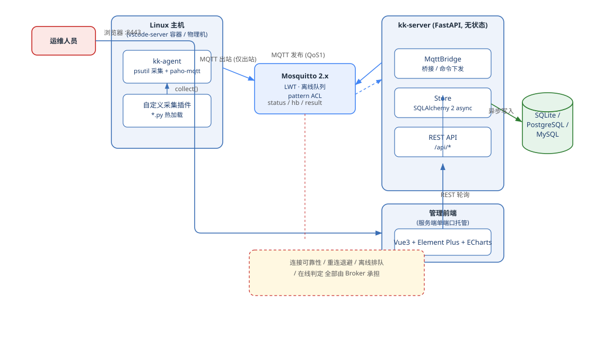

<div align="center">

# KontainKeeper

Linux 主机（典型形态：K8S 下的 vscode-server 容器 IDE）的**直连管理与指标提取平台**

[](https://github.com/taoweidong/KontainKeeper/blob/main/LICENSE)
[](https://github.com/taoweidong/KontainKeeper/stargazers)
[](https://github.com/taoweidong/KontainKeeper/network/members)
[](https://github.com/taoweidong/KontainKeeper/issues)
[](https://www.python.org/downloads/)
[](https://fastapi.tiangolo.com/)
[](https://mosquitto.org/)
[](https://vuejs.org/)
[](https://www.sqlalchemy.org/)
[](https://github.com/astral-sh/uv)
[](https://www.docker.com/)

</div>

- 不依赖 K8S 集群能力（无 kube-api / exec / svc），不触碰宿主机
- Agent 随镜像内置（镜像制作期介入），主机启动后台自启，**用户无感知**
- Agent 主动出站 **MQTT** 连 Broker → 心跳上报指标 + 远程命令 + 自定义采集
- 服务端 FastAPI 无状态桥接，支持 SQLite / PostgreSQL / MySQL
- 前端 Vue3 + Element Plus + ECharts，构建产物由服务端直接托管

完整设计见 [docs/design.md](docs/design.md)，协议定义见 [proto/messages.md](proto/messages.md)（v2 MQTT）。

## 架构一览



连接可靠性、重连退避、离线命令排队、在线判定全部由 Broker 承担，服务端不持有长连接状态。

<details><summary>PlantUML 源码</summary>


</details>

## 仓库结构

```
pyproject.toml           UV 工作区虚拟根（package=false，members=[server, agent]）
agent/                   kk-agent 客户端（独立 UV 项目，编译为单文件二进制）
  src/kk_agent/          Agent 源码：transport(MQTT)/collector(psutil)/executor/updater
  tests/                 Agent 单元测试
  build/                 PyInstaller 编译脚本
  deploy/                容器叠加片段 + entrypoint-wrapper
server/                  服务端（独立 UV 项目，FastAPI）
  src/kk_server/         服务端源码；web/ 为 Vue3 构建产物（随包打包）
  tests/                 Server 单元测试 + 端到端集成
  Dockerfile             生产镜像
web/                     Vue3 前端（独立 pnpm 工程，pure-admin-thin 底座）
  src/api/               业务 API 层（containers/commands/audit/system）
  src/views/             四个业务页（host/monitor、host/detail、command、audit）
proto/                   双端通信协议契约（v2）
scripts/                 构建与部署脚本
deploy/                  Mosquitto 生产/开发配置 + Agent 容器叠加片段
docs/                    design / completion-plan-mqtt / architecture-review
```

## 文档

- [设计文档](docs/design.md)：整体架构、Broker 居中设计与存储治理
- [架构评审](docs/architecture-review.md)：缺陷清单与处置映射（P0/P1/P2 + R1–R12）
- [实现路线图 v3](docs/completion-plan-mqtt.md)：MQTT 收尾 + Vue3 前端的八阶段落地计划
- [通信协议 v2](proto/messages.md)：MQTT 主题布局、帧格式、QoS/retain 语义与 8 项采集白名单
- [部署说明](deploy/mosquitto/README.md)：Mosquitto 开发/生产双配置、按主机 ACL 与账号生成

> 所有协议与配置以代码为唯一真相源；文档若与代码冲突，以代码与 `git` 历史为准。

## 快速开始（本机体验全链路）

```bash
uv sync --all-packages          # 安装服务端依赖 + dev 组

# 0. 起一个 MQTT Broker（本地冒烟用开发配置，开匿名；生产见 deploy/mosquitto/README.md）
docker run -d --name mosquitto -p 1883:1883 \
  -v $PWD/deploy/mosquitto/mosquitto.dev.conf:/mosquitto/config/mosquitto.conf \
  eclipse-mosquitto:2

# 1. 启动服务端
.venv/Scripts/python.exe -m kk_server      # 或 uv run kk-server
#   浏览器打开 http://127.0.0.1:8443 → 登录管理界面（默认 admin/admin）

# 2. 启动一个 Agent（任意目录）
KK_SERVER=mqtt://127.0.0.1:1883 KK_TOKEN=dev-token \
KK_HOST_NAME=demo-host KK_INTERVAL=5 uv run kk-agent

# 3. 管理界面：主机总览出现 demo-host → 详情页看曲线 → 命令中心下发命令 → 结果回传
```

> Windows 开发机若用 `.venv` 直调失败，注意 `uv run` 会尝试下载 Python 3.12，
> 直接用 `.venv/Scripts/python.exe` 更稳。

## 部署到生产

### 1. 服务端

```bash
# 构建上下文为仓库根：Dockerfile 使用根 uv.lock + uv sync；.dockerignore 已排除前端/依赖等大目录
docker build -f server/Dockerfile -t registry.example.com/kontainkeeper-server:0.1.0 .
docker run -d --name kontainkeeper \
  -p 8443:8443 \
  -v kontainkeeper-data:/data \
  -e KK_MQTT_URL=mqtt://broker:1883 \
  -e KK_AGENT_TOKENS=<token> \
  -e KK_ADMIN_USER=admin \
  -e KK_ADMIN_PASS=<强密码> \
  registry.example.com/kontainkeeper-server:0.1.0
```

服务端无状态，多实例部署时 `KK_MQTT_CLIENT_ID` 必须逐实例唯一（共用会被 Broker 互踢）。

服务端环境变量：

| 变量 | 说明 | 默认 |
|---|---|---|
| `KK_MQTT_URL` | Broker 地址（`mqtt://` / `mqtts://`） | 必填 |
| `KK_MQTT_USERNAME` / `KK_MQTT_PASSWORD` | Broker 鉴权（生产必须） | 空 |
| `KK_MQTT_CLIENT_ID` | 实例唯一 client_id | `kk-server` |
| `KK_MQTT_TLS_CA` / `KK_MQTT_TLS_INSECURE` | TLS 配置 | 空 |
| `KK_TOPIC_PREFIX` | 主题前缀（**双端同名，必须一致**） | `kk/v1` |
| `KK_DB_URL` | `sqlite:///...` / `postgresql://...` / `mysql://...` | SQLite |
| `KK_AGENT_TOKENS` | 逗号分隔的 Agent 接入 token | `dev-token` |
| `KK_ADMIN_USER` / `KK_ADMIN_PASS` | 管理员账号 | `admin`/`admin` |
| `KK_CMD_BLACKLIST` | 命令黑名单（逗号分隔子串） | `rm -rf /,mkfs,reboot,...` |
| `KK_WEB_DIR` | 前端静态目录 | 包内 `web/` |

> **TLS 硬约束（生产必须）**：Broker 连接生产应用 `mqtts://` 或置于内网可信区；
> 管理端 Web 必须前置 TLS 终结的反向代理，切勿让管理员令牌明文跨越不可信网络。

### 2. 主机侧（镜像制作期介入）

在 vscode-server 镜像 CI 中调用构建脚本，叠加 Agent 并注入接入配置：

```bash
BASE_IMAGE=myregistry/vscode-server:1.2 \
KK_SERVER=mqtt://broker.ops:1883 \
KK_TOKEN=<与 KK_AGENT_TOKENS 一致> \
  ./scripts/build.sh myregistry/vscode-server-managed:1.2
```

目标镜像**无需内置 Python**——Agent 已编译为单文件二进制随镜像分发。
产物镜像入口透传采用 Docker 原生机制：`kk-entrypoint` 作为 ENTRYPOINT 首元素，
原入口其余元素以参数透传，前台 `exec "$@"` 拉起原入口——主机生命周期 = 原 IDE 生命周期。

### 3. Agent 环境变量（镜像内已注入，一般无需改动）

| 变量 | 说明 | 默认 |
|---|---|---|
| `KK_SERVER` | Broker 地址（`mqtt://` / `mqtts://`） | 必填 |
| `KK_TOKEN` | 接入 token | 必填 |
| `KK_HOST_NAME` | 主机标识（旧名 `KK_POD_NAME` 兼容） | hostname |
| `KK_TOPIC_PREFIX` | 主题前缀，与服务端一致 | `kk/v1` |
| `KK_INTERVAL` | 心跳/采集间隔（秒，下限 1） | `60` |
| `KK_DISK_PATHS` | 采集的挂载点 | `/,/workspace` |
| `KK_HB_ITEMS` | 心跳采集项（逗号分隔，白名单子集；空=全部 8 项。千进程主机可去掉 `proc`） | 全部 |
| `KK_PLUGIN_DIR` | 自定义采集插件目录 | `/opt/kk-agent/plugins` |
| `KK_PLUGIN_TIMEOUT` | 插件 `collect()` 超时（秒），超时插件被隔离直到重载 | `5` |
| `KK_ALLOW_SHELL` | 允许 `use_shell` 管道模式 | `1` |
| `KK_MAX_OUT_MB` | 单命令输出上限 | `4` |
| `KK_MAX_QUEUED` | 离线 out-queue 上限 | `512` |
| `KK_UPDATE_URL` | 管理 API 基址（自更新用） | 必填，未配则跳过自更新 |
| `KK_UPDATE_INTERVAL` | 版本轮询间隔（秒，≥30） | `300` |
| `KK_UPDATE_DISABLED` | 设为 `1/true` 关闭自更新 | 关闭 |
| `KK_AGENT_BIN` | 自更新替换目标路径 | 自动 |

### 4. Agent 自更新（零人工干预）

Agent 内置版本监控：上线时服务端比对版本，落后即推送 `kind=update` 帧；运行中亦按
`KK_UPDATE_INTERVAL` 定时轮询。发现新版本后用自身 token 下载二进制，校验 `sha256`
一致后原子替换并 `execv` 自重启。

发布新版本（管理员）：

```bash
cd agent && ./build/build_binary.sh
curl -H "Authorization: Bearer <ADMIN_TOKEN>" -F "version=0.2.0" \
     -F "file=@dist/kk-agent" https://kk-server.ops:8443/api/system/agent
```

## 自定义采集插件

在目标主机往插件目录放任意 `*.py`（实现 `collect() -> dict`），随心跳自动上报，
mtime 变化即热加载，无需重启：

```python
def collect():
    return {"extension_count": 42}
```

也可在命令中心对勾选的主机下发 `plugin_reload` 立即采集回传。

## 按项采集（`kind=collect`）

服务端可对批量主机下发「只采集指定指标项」的命令，不经 shell、直接调 psutil：

```bash
curl -H "Authorization: Bearer <ADMIN_TOKEN>" \
  -H "Content-Type: application/json" \
  -d '{"kind":"collect","items":["cpu","mem","net"],"pods":["web-01","web-02"]}' \
  https://kk-server.ops:8443/api/commands
```

采集项白名单（8 项，双端一致）：`cpu, mem, disk, disk_io, net, proc, user, sys`。
可选项清单也可从 `GET /api/collect/items` 获取。

## 管理界面

- **主机总览**：在线状态、CPU/内存/磁盘摘要、多选批量下发（10s 轮询）
- **主机详情**：ECharts 指标曲线、磁盘/网卡/进程/登录用户、最近命令（30s 轮询）
- **命令中心**：采集面板（勾选指标项 × 主机）+ 命令面板（argv 数组 / cmdline 双模）、
  历史列表与输出查看（5s 轮询）
- **审计日志**：登录、命令下发、黑名单拦截全量留痕
- **系统统计**：`GET /api/system/stats` 返回主机/命令/存储/Broker 四组可观测数据

## 测试

```bash
uv sync --all-packages
.venv/Scripts/python.exe -m pytest agent/tests -q     # Agent 单元测试
.venv/Scripts/python.exe -m pytest server/tests -q    # Server 单测 + 端到端集成
.venv/Scripts/python.exe -m pytest agent/tests server/tests -q   # 全量：193 passed, 3 skipped

cd web && pnpm typecheck && pnpm build                # 前端类型检查与构建
```

`agent/tests` 覆盖 MQTT 传输（主题/QoS/retain/离线队列）、psutil 采集、命令执行、
插件热加载、自更新。`server/tests` 覆盖存储层（含三库方言静态校验）、桥接路由与归属校验、
黑名单、审计、REST 接口契约（ASGI Transport）、以及**真实服务端 + 真实 Agent 线程**的端到端集成
（需 Broker，端口不可达时自动 skip）。

> 已知验证边界：SQLite 走完整实测；PostgreSQL / MySQL 只做了 DDL 与语句的跨方言编译校验，
> **未连过真实库**，上线前需补真库跑测。

## 安全说明

- Agent ↔ Broker：MQTT 鉴权（用户名 = 主机名）+ pattern ACL `kk/v1/%u/#`，
  一台主机只能读写自己的主题
- 主机身份：Broker 已认证用户名 ↔ `status` 帧 `host` 一致，不一致即拒并审计
- 管理端：会话 token（默认 12 小时过期），命令下发全量审计
- 命令黑名单拦截危险操作；argv 数组直传 exec，不经 shell 拼接
- 自更新二进制强制 `sha256` 校验（可选 HMAC）

## 参与贡献

欢迎以 Issue / Pull Request 参与。提交前请先跑通测试（`uv sync --all-packages` 后
`pytest agent/tests server/tests -q`），并确保 `web/` 前端 `pnpm typecheck && pnpm build` 通过。
重大改动建议先对照 [实现路线图 v3](docs/completion-plan-mqtt.md) 与
[架构评审](docs/architecture-review.md)，避免与已落地的设计决策冲突。

## 许可证

本项目以 [MIT License](LICENSE) 开源。

## 星标趋势

[](https://starchart.cc/taoweidong/KontainKeeper)

## 贡献者

<a href="https://github.com/taoweidong/KontainKeeper/graphs/contributors"></a>

---

<p align="center">如果本项目对你有帮助，欢迎点 ⭐ Star 与提交 PR。</p>
