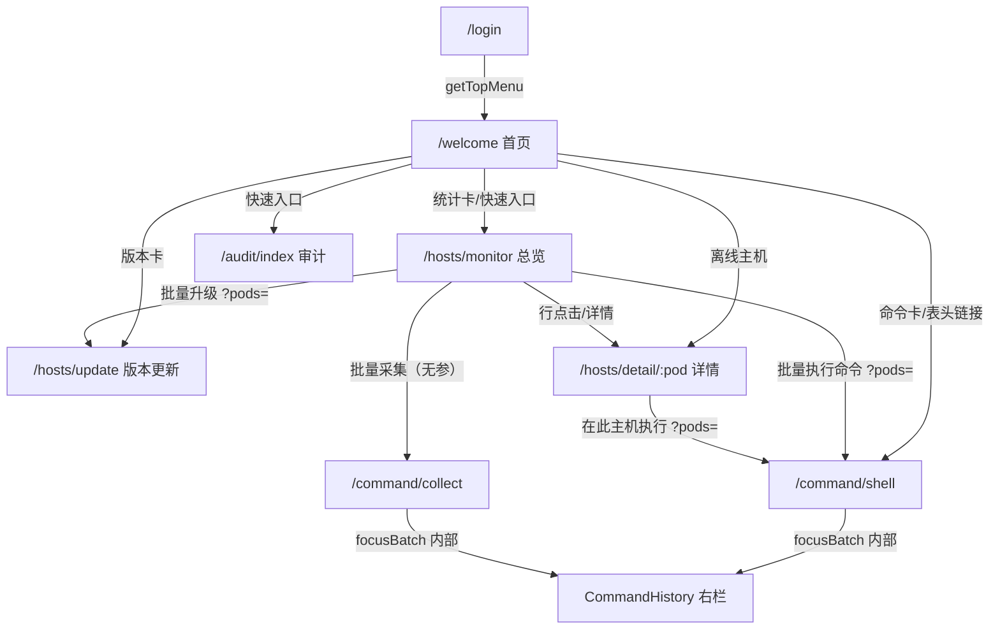

# KontainKeeper 前端代码与体验优化方案（2026-10-07）

> 范围：`web/` 现有前端。**保持已有业务场景与功能不变**，只做代码结构、交互流程、布局与可访问性的优化。
> 本轮为**分析与方案**，不含代码改动。所有条目都标了文件/组件位置、优先级、以及「是否影响现有功能 / 需要什么回归验证」。

---

## 0. 结论速览

| 维度 | 判定 | 一句话 |
|---|---|---|
| 业务功能完整性 | ✅ | 6 个业务页 + 登录 + 3 个错误页，链路闭环，无缺失功能 |
| 路由与菜单 | ✅ | 全静态路由，dev/prod 行为一致（这是本仓最干净的决策之一，不要动） |
| 交互反馈 | ⚠️ 有硬伤 | 登录失败**零提示**（P1）、跨页下发**丢上下文**（P1）、批量升级**只报数不报原因**（P1） |
| 布局一致性 | ⚠️ 分裂 | `--kk-page-h` 高度锚点**只对命令中心生效**，其余 5 页各写各的（P1） |
| 可访问性 | ⚠️ | 整行可点但不可 Tab；`lang="en"`；品牌残留 `PureAdmin`（P2） |
| 代码组织 | ⚠️ | 全量拉主机 3 处重复、状态映射 3 套、死代码 4 块 + 2 处、`any` 105 处（P1/P2） |
| 渲染性能 | ⚠️ | 500 台非虚拟表 + 表格高度无约束（P1）；`el-checkbox` 双 prop 弃用（P2） |
| 包体 | ⚠️ | 首屏 chunk 1.28MB，Element Plus 全量注册，dev 工具打进 prod（P2） |
| 测试防线 | ❌ | **前端零测试**（0 个 spec、无 vitest/playwright 配置），lint 不在门禁 |

**建议批次**：批次 A（正确性/体验硬伤，1–2 天）→ 批次 B（布局与可访问性，2–3 天）→ 批次 C（性能与代码整洁，排期）。批次 A/B 必须回归 6 个业务页的完整链路。

---

## 1. 现状分析

### 1.1 页面清单与职责

| 路由 | 组件 | 职责 | 入口 | 出向跳转 |
|---|---|---|---|---|
| `/login` | `views/login/index.vue`（182 行） | 账号口令登录 → 拿 token | 直接访问；401/403 被动跳入 | `getTopMenu(true)` → `/welcome` |
| `/welcome` | `views/welcome/index.vue`（477 行） | 首页汇总：4 张统计卡 + 最近命令 + 快速入口 + 离线主机 + 系统状态 | 侧边栏「首页」；登录后落地 | → `/hosts/monitor`、`/command/shell`、`/audit/index`、`/hosts/update`、`/hosts/detail/:pod` |
| `/hosts/monitor` | `views/host/monitor/index.vue`（474 行） | 主机总览：仪表带 + 筛选 + 表格 + 吸底批量栏 | 侧边栏「主机管理」；多处下钻 | → `HostDetail`；→ `CommandShell?pods=`；→ `CommandCollect`（**无参**）；→ `HostUpdate?pods=` |
| `/hosts/detail/:pod` | `views/host/detail/index.vue`（364 行） | 单机详情：descriptions + ECharts 曲线 + 磁盘/网卡/进程/用户 + 最近命令 | 总览表格行/操作列/最近命令；首页离线列表 | → `CommandShell?pods=<pod>` |
| `/hosts/update` | `views/host/update/index.vue`（303 行） | 版本与更新：待分发版本 + 落后主机勾选升级 + 升级台账 | 侧边栏「主机管理」；首页版本卡；总览「批量升级」 | 无出向（页内 `load()` 自刷新） |
| `/command/shell` | `views/command/shell/index.vue`（174 行） | shell 命令下发（cmdline / argv 双模） | 侧边栏「命令中心」；总览批量栏；详情页按钮 | → `CommandHistory.focusBatch()` |
| `/command/collect` | `views/command/collect/index.vue`（105 行） | 按项勾选指标下发 collect | 侧边栏；**总览批量采集提交后跳转（不带参）** | → `CommandHistory.focusBatch()` |
| `/audit/index` | `views/audit/index.vue`（172 行） | 审计日志检索 + 导出 | 侧边栏「审计日志」；首页快速入口 | 无 |
| `/403 /404 /500` | `views/error/*.vue` | 全屏错误页 | 路由内部 | 无 |

**共享组件**（均在 `src/`）：

| 组件 | 被谁用 | 说明 |
|---|---|---|
| `CommandWorkbench.vue` | shell + collect | 双栏骨架（左执行 / 右结果），`#form` + `#result` 两个 slot，窄屏 ≤1200px 折叠 |
| `CommandHistory.vue` | shell + collect | 执行历史：自适应轮询（3s/10s）、批次筛选、分页、输出抽屉、CSV 导出 |
| `HostPicker.vue` | shell + collect | 抽屉式多选主机（搜索/仅在线/全选/反选），对外契约 `v-model:pods` |
| `Re*`（9 个） | 底座 | pure-admin 遗留：`ReDialog/ReText/ReIcon/RePureTableBar/ReAuth/RePerms/ReSegmented/ReCol` —— **业务页几乎不用** |
| `kk.scss` 器件族 | 全部 6 页 | `kk-card / kk-toolbar / kk-actions / kk-sub / kk-band / kk-state / kk-meter / kk-ticks / kk-num / kk-sticky-bar / kk-fill-table` |

**工具层**：`utils/kk.ts`（格式化 + 状态映射）、`utils/kkPoll.ts`（作用域轮询）、`utils/kkConfirm.ts`（批量二次确认）、`utils/http/index.ts`（axios 封装）。API 层 7 个模块，后端路径 `/api/*`。

### 1.2 路由与跳转关系



**契约观察**：
- 跨页带主机统一走 `?pods=a,b,c`（逗号分隔），4 处 `router.push` 里有 3 处带、**1 处不带**（`monitor:148`）→ 见 P1-3。
- 命令体**不落 URL**（QR-W6 已修），但 `shell/index.vue:114` 仍保留读 `?cmdline=` 的兼容分支 —— 有意保留的兼容代码，不是 bug，但需要注释说明「只读不写」。
- 6 个业务路由全在 `router/modules/kk.ts` 静态声明；`getAsyncRoutes()` 硬编码返回 `[]`（`api/routes.ts:14`），并用 `void http;` 消除 unused-import（`api/routes.ts:20`）—— 能跑但属于技术债。

### 1.3 核心流程现状

**流程 A：登录**
```
输入 → el-form rules 校验 → POST /api/login
  ├─ 成功 → setToken → initRouter() → getTopMenu(true).path → "登录成功" toast
  └─ 失败 → Promise reject → .finally(loading=false)   ← 无 .catch，无任何提示
```
后端登录失败返回 **401**（`auth.py:91` `HTTPException(401, "用户名或密码错误")`），429 有频率限制。

**流程 B：总览 → 批量采集（跨页）**
```
勾选 N 台 → 吸底栏「批量采集」→ 弹窗勾采集项 → POST /api/commands(kind=collect)
  → toast「已下发 N 条」→ router.push(CommandCollect)   ← 不带 pods
  → 目标页 onMounted 读 route.query.pods（空）→ 目标主机选择器显示「未选择主机」
```

**流程 C：命令下发（shell/collect）**
```
选主机(HostPicker 抽屉) → 填命令 → Ctrl/Cmd+Enter 或点按钮
  → confirmDispatch(选中>1 时弹二次确认，含在线/离线台数与「离线会排队补投」说明)
  → POST /api/commands → toast → history.focusBatch(batch_id, ids)
  → CommandHistory 定位批次 + 本次行加左侧色条 + 间隔切到 3s
  → 行点击 → 右侧抽屉拉全量输出（可下载）
```
这是全项目最完整的一条链路，体验设计到位（离线语义如实告知、批次定位、色条高亮、抽屉不遮挡列表）。

**流程 D：批量升级**
```
总览勾选（仅落后主机可点「批量升级」→ ?pods=）
  → update 页 prefillFromQuery → applySelection（表格勾选回显）
  → 「批量升级」→ ElMessageBox 确认（含离线台数与 queued 语义说明）
  → POST /api/system/agent/upgrade
  → toast「已受理 N 台，其中 M 台离线会补投，跳过 K 台」   ← K 台的原因被丢弃
  → selection 清空 → load()
```

**流程 E：轮询（5 处）**
| 页面 | key | 间隔 | 失败反馈 |
|---|---|---|---|
| welcome | `welcome` | 10s | ❌ 每 10s 弹一次 toast |
| monitor | `host-monitor` | 5/10/30s/0（可调） | ✅ 表头同步读数变冷（QR-W5 已修） |
| detail | `host-detail` | 30s 固定 | ❌ toast |
| update | `host-update` | 5/10/30s | ❌ toast |
| CommandHistory | `command-history` | 3s/10s 自适应 | ❌ toast |

底层 `utils/kkPoll.ts` 质量不错：作用域化清理（`onScopeDispose`）+ 在途防重入 + 异常吞掉不影响定时器。**问题在调用方的错误反馈策略不统一**。

### 1.4 布局与样式基建现状

`style/kk.scss`（413 行）是全站业务样式的唯一来源，设计基座（2026-10-06）已收敛得不错：

```scss
:root {
  --kk-page-h: 152px;      /* 全站唯一高度锚点 */
  --kk-drawer-h: 300px;
  --kk-font-num: ui-monospace, ...;   /* 读数等宽栈 */
  --kk-live / --kk-alert / --kk-stale / --kk-idle;   /* 四档状态色 */
}
.kk-page { height: calc(100vh - var(--kk-page-h)); }
```

**但 `--kk-page-h` 的地基只被一个组件使用**：

| 页面 | 根节点 | 是否用 `.kk-page` | 表格高度行为 |
|---|---|---|---|
| command/shell、command/collect | `.kk-page`（CommandWorkbench） | ✅ | `kk-fill-table` flex 生效，**内部滚动**，页面不滚 |
| host/monitor | `<div>`（`:232`） | ❌ | `el-card__body` 是 block → `flex:1/min-height:0` **失效** → 500 行把页面撑到约 17000px，靠外层 `el-scrollbar` 滚 |
| audit | `<el-card>`（`:102`） | ❌ | 同上，且 `kk-page__body` 单独存在（`:126`）像是半途改过 |
| host/update | `<div v-loading>`（`:185`） | ❌ | 两个 card 纵向堆叠，页面滚 |
| host/detail | `<div v-loading>`（`:200`） | ❌ | 5 张表全用硬编码 `max-height`（220/260/240） |
| welcome | `<div class="welcome">`（`:131`） | ❌ | `.cmd-table` 高度由右栏卡片内容反推 |

其他布局观察：
- 高度锚点用 `100vh` 而非容器高度，`--kk-page-h: 152px` 是手算值（navbar 48 + tabs 33 + 内容留白），底座改尺寸就漂（kk.scss:20 注释自己承认）。
- 响应式只有两个断点：`kk-side` 的 1200px、detail 的 `descCols` 1200px（`useWindowSize`）。**没有 768/992 档**，`el-row :xs/:sm/:lg` 只在 welcome 用了。
- `.kk-batch`（`margin-top:12px`）与 `.kk-sticky-bar`（sticky bottom）在 monitor 同时挂；`.kk-card + .kk-card{margin-top:16px}` 的特异性高于 `.kk-mt{margin-top:8px}` → update 页第二个 card 的 `kk-mt` **是死代码**。

### 1.5 代码组织与依赖现状

```
src/ 171 文件 · 13,791 行（.vue + .ts）
├─ api/          7 个模块，类型与后端 controller 一一对应，注释规范（本次分析中最干净的一层）
├─ utils/        kk / kkPoll / kkConfirm / http / auth / message / tree / responsive + 4 块死代码
├─ views/        6 业务页 + 登录 + 3 错误页，业务页最大 477 行（≤500 自律线成立）
├─ components/   Re* 9 个（底座遗留，业务页几乎不用）
├─ layout/       底座（lay-tag 690 行、lay-setting 631 行）
├─ directives/   6 个（含 optimize/ripple/longpress，业务页仅 longpress 在用）
└─ store/        app / user / permission / settings / multiTags / epTheme（**无业务 store**）
```

- **无任何 Pinia 业务 store**：主机列表、命令历史、采集项全部页面内 `ref` 自管 → 3 处重复全量拉取、状态无法跨页共享。
- `any`/`as any` 共 **105 处**（`src/views/` 30 处）；`tsconfig.json` `strict:false` + `strictFunctionTypes:false`；`eslint.config.js` `.vue` 段 `no-unused-vars:"off"` + `no-explicit-any:"off"` → 类型与死代码都无兜底（QR-W2/W9 已登记，未修）。
- 死代码：`utils/print.ts`（223 行，9 处 `@ts-expect-error`）、`utils/localforage/`（275 行）、`utils/sso.ts`、`utils/globalPolyfills.ts` —— 引用数实测 0/0/1（仅注释）/0。
- 依赖：`dayjs` 声明但**零使用**；`plugins/echarts.ts`（40 行）未启用（`main.ts:6` 注释）而 detail 页自己 `echarts.use([...])` → 两处 echarts 注册意图重复；`@pureadmin/descriptions`、`sortablejs`、`pinyin-pro`、`path-browserify` 仅底座引用。
- 构建：`element-plus` **全量注册**（`plugins/elementPlus.ts` 列了 ~240 个组件）→ 首屏 chunk 1.28MB；`codeInspectorPlugin` 与 `vitePluginFakeServer({enableProd:true})` **无生产条件判断**；无 `manualChunks`。
- 前端测试：**0 个 `.spec.ts`/`.test.ts`，无 vitest/playwright 配置**。

---

## 2. 问题定位

> 优先级口径：**P0** 阻断/数据错误 → **P1** 用户可感知的功能或体验缺陷 → **P2** 质量/性能债 → **P3** 整洁性。
> 「回归」列标注该改动**是否影响现有功能**以及需要验证什么。

### 2.1 P1 — 用户可感知的体验硬伤

| ID | 位置 | 问题 | 后果 | 回归 |
|---|---|---|---|---|
| **FE-1** | `views/login/index.vue:46-75` | `loginByUsername().then().finally()` **无 `.catch`**；后端 401 会走 `http/index.ts:96-99` 的 `logOut()`（清 token + `resetRouter` + `push("/login")`） | **输错口令 → 页面毫无反应**，按钮停 loading 后就静默；用户不知道是密码错还是服务挂了。这是登录路径上最严重的体验缺陷 | 不影响功能，改动仅前端提示。回归：错误口令、锁定 429（后端 `auth.py:65`）、后端宕机三种情形 |
| **FE-2** | `utils/http/index.ts:96-99` | 401 **与 403** 一律 `logOut()` | 后端对「无权访问」返 403 时会**误踢登录态**。需核 `deps.agent_ip_auth` 的实际返回码（标假设） | 影响鉴权链路。回归：越权访问接口时是否掉登录；确认后端 403 语义 |
| **FE-3** | `views/host/monitor/index.vue:148` | 批量采集提交后 `router.push({ name: "CommandCollect" })` **不带 `?pods=`**；目标页 `collect/index.vue:73` 只认 `route.query.pods` | 运维勾了 5 台 → 下发成功 → 跳到采集页发现「未选择主机」，得**重新手选一遍**。而同样是跨页的 `gotoUpgrade`/`gotoCommand` 都带了参 | 不改后端契约，仅补 query。回归：总览批量采集全链路 + 采集页预选回显 |
| **FE-4** | `views/host/update/index.vue:152-155` | 升级结果 `skipped[]`（含 `host` + `reason` 六种枚举）**只汇总成一句「跳过 K 台」**；同文件 `:52` 的 `SKIP_REASON_LABEL` 映射表**定义了却从未使用** | 500 台批量升级若有 30 台被跳过（`no_binary`/`in_flight`/`already_latest`），运维**无从知道哪些、为什么**，只能去翻台账表按行猜 | 不改后端。回归：构造多种 skipped 原因验证文案；`SKIP_REASON_LABEL` 可提到 `utils/kk.ts` 与 detail 页共用 |
| **FE-5** | 5 处页面根 + `style/kk.scss:46-65` | `--kk-page-h` 高度锚点只对 `CommandWorkbench` 生效；monitor/audit/update/detail/welcome 的 `kk-fill-table` 因父级非 flex 而**完全失效** | 总览 500 行 → 页面被撑到约 17000px，页头仪表带与吸底批量栏**随之滚走**，失去「随时可见」的仪表语义；detail 的 5 张表改用硬编码 `max-height` | **影响面最大的一条**。回归 6 页在 1366×768 / 1920×1080 / 2560 宽下的表格内滚与吸底栏；命令中心必须保持现状不变（它是对的） |
| **FE-6** | `views/host/monitor/index.vue` + `CommandHistory` + `audit` + `detail` + `update` | 轮询失败一律 `ElMessage.error`（welcome:86、detail:119、CommandHistory:60、audit:38） | 后端宕机时每 3–10s 弹一次 toast，**噪音淹没真实错误**；monitor 页已修（表头同步读数变冷），其余 4 页未修（QR-W5 只修了一页） | 不改功能，改反馈载体。回归：停后端后各页只出现一处状态提示、不刷屏 |
| **FE-7** | `views/host/monitor/index.vue:129-132` | 行级「采集」执行 `selection.value = [row]`，**静默覆盖用户在表格里的多选** | 用户勾了 10 台正想批量采集，误点某行「采集」→ 选择被清成 1 台且无任何提示 → 下发范围与预期不符 | 不改功能，改交互（单台走独立参数，不污染批量选择）。回归：单行采集 + 批量采集共存 |
| **FE-8** | `views/audit/index.vue:68-71,62-66,113` | `limit` 同时被 `watch(limit)`、`onSizeChange()`、`el-select @change="load"` 三条路径触发 | 改一次「每页条数」**发 2 次请求**；`total`/`offset` 在并发回包下可能错位 | 不改功能，去重。回归：审计分页 + 改条数 + 导出范围一致 |

### 2.2 P2 — 质量、性能与可访问性

| ID | 位置 | 问题 | 建议 | 回归 |
|---|---|---|---|---|
| **FE-9** | `views/host/monitor/index.vue:66`+`utils/kk.ts`+`shell:46`+`collect:35`+`HostPicker:56` | `listHosts("summary")` **5 处独立全量拉取**，无缓存、无共享；页面切换反复打同一个接口（QR-W7 已登记未修） | 提 `store/modules/hosts.ts`（或 `useHostList()` composable）：单飞请求 + 30s TTL + 共享订阅 | 影响 5 页首屏与切换。回归：并发进入 shell+collect 时只发 1 次；离线态行为不变 |
| **FE-10** | `host/monitor`（无虚拟表）、`api/containers.ts:73` | 500 台全量灌进非虚拟 `el-table`；`filtered` 每轮全量重算；`tickState(row)` 在模板里每行调用 2 次并**每次新建 `{n,cls}` 对象** | 上 `el-table-v2`（本仓已明确不做全家桶，仅总览按需）；或后端分页 + 前端分页。`tickState` 改在 `filtered` 里预计算或用 `Map` 缓存 | 500 台滚动帧率回归；行高/列宽/固定列行为不变 |
| **FE-11** | `CommandHistory.vue:83` `watch([rows], restartTimer)` | 轮询每回一次包就 `restartTimer` → `clearPoll` + 新建 `setInterval`。语义变成「间隔 = 设定值 + 请求耗时」，**定时器漂移**；且在定时器回调内重建自身 | 改为「按状态变化决定是否换间隔」，而不是「每次回包都换」；`restartTimer` 只在 `autoRefresh`/筛选/页大小/首帧状态翻转时调用 | 轮询节奏回归（3s/10s 生效且不漂） |
| **FE-12** | `CommandHistory.vue:145-162` `showOut` | 连点两行，慢响应会把抽屉内容换成**另一条命令的输出**，且 `out.id` 与文本可能错配 | 引入序号校验（`useSeq()`）或 `AbortController`，回包序号不匹配则丢弃 | 抽屉输出正确性回归（快速连点 3 行） |
| **FE-13** | `CommandHistory.vue:91-98` | `kwTimer` **无卸载清理**（audit 页 `:53` 有做，这里漏了） | `onBeforeUnmount` 里 `clearTimeout` | 低风险 |
| **FE-14** | `host/detail/index.vue:37,178-190` | `pod` 是 `computed(route.params.pod)` 但**无 `watch(pod)`**；当前靠 `lay-content` 的 `:key="fullPath"` 强制重建才没出事 | 显式 `watch(pod, load)`，不依赖底座的 key 行为 | 详情页内换主机（同页不同 pod） |
| **FE-15** | `host/detail/index.vue:189,126-128` | 只用 `window.addEventListener("resize")`；**侧边栏折叠/展开、窗口非 resize 的布局变化不触发** → 图表宽度错位 | 用 `ResizeObserver` 观察容器（`@vueuse/core` 已在依赖里，`useResizeObserver` 现成） | 折叠侧边栏、拖拽布局、缩放后图表自适应 |
| **FE-16** | `host/detail/index.vue:66-72` | 每个数据点 `new Date().toLocaleString("zh-CN", fmt)`，24h 窗口约 1440 点 × 每次 `setOption`；`Intl` 格式化在热路径上 | 改 `dayjs`（**已在依赖里，零使用**）或把格式化交给 `axisLabel.formatter`（传时间戳，格式化只在渲染时做） | x 轴刻度文案回归（6h/24h/7d 三档） |
| **FE-17** | 全站 `el-table` 的 `@row-click`（monitor:316、CommandHistory:276、welcome:196） | 整行可点但**不可 Tab 聚焦、无 `role`/键盘事件**；`aria` 只在个别 `kk-ticks`（`aria-hidden`）和仪表带（`role=img`）上做了 | 主机列已有 `el-link` 兜底（可 Tab），可接受；但需补 `tabindex`/Enter/Space 或明确记为「已知取舍」；welcome 的 `clickable` 卡片与 `quick-link`/`offline-host` 是纯 `div`，**完全不可键盘操作** → 改 `button`/`role="button" tabindex="0"` | 可访问性回归：纯键盘走通欢迎页全部入口 |
| **FE-18** | `index.html:2`、`:6`、`:11`；`public/platform-config.json:3`；`layout/components/lay-footer/index.vue:14` | `lang="en"`（全中文站）；`viewport` 含 `user-scalable=0`（阻断缩放，无障碍反模式）；`<title>pure-admin-thin</title>` + `Title: "PureAdmin"` → `document.title` 变成「xxx \| PureAdmin」；页脚挂着 pure-admin 仓库外链 | `lang="zh-CN"`、去 `user-scalable`、标题与页脚换品牌 | 无功能影响。回归：浏览器标签页标题、页脚渲染 |
| **FE-19** | `plugins/elementPlus.ts` 全量 ~240 组件；`build/plugins.ts:33-36`（inspector 无条件）、`:50-55`（fakeServer `enableProd:true`）；无 `manualChunks`；`vite.config.ts:74` `chunkSizeWarningLimit:4000` | 首屏 `index-*.js` **1.28MB**；`chunkSizeWarningLimit:4000` 把警告阈值抬到 4MB，等于**静音体积告警**；dev 调试工具（Alt+Shift 源码定位）打进生产包 | ① `chunkSizeWarningLimit` 降到 500 并记录基线；② inspector/fakeServer 用 `mode !== "production"` 包起来；③ 手动分 `vendor-element` / `vendor-echarts` | **改构建配置，需完整 build + 页面回归**（尤其 fakeServer 关掉后 mock 目录必须仍存在） |
| **FE-20** | `host/monitor:448-454`、`command/collect:88-90` | `el-checkbox` 同时传 `:label` 和 `:value` | EP ≥2.6 起 `label` 作为值已被 `value` 取代，双传会触发弃用告警 → 只留 `:value`，文案用默认插槽 | 低风险。回归：采集项勾选与回显 |
| **FE-21** | `audit/index.vue:127-149` | `el-table` 与 `el-table-column` 缩进错位（`:127` 起），说明 **prettier 漂移且无人发现**（`pnpm lint` 不在门禁，remediation 2.2 已登记未做） | 跑一次 `pnpm lint` 并把 lint 进门禁 | 无功能影响 |
| **FE-22** | `utils/http/index.ts:107-131`；7 个 api 模块 | `request()` 用 `new Promise` 包 `axios.request().then().catch()` —— 比直接 `return` 多一层，且 `catch(error => reject(error))` 是恒等函数 | 直接 `return PureHttp.axiosInstance.request(config)` | 无行为影响（响应拦截器已把 `response.data` 作为 resolve 值） |
| **FE-23** | `plugins/echarts.ts`（未启用）+ `host/detail:33`（自己 use） | echarts 注册点两处、意图重复；前者注册了 Pie/Bar/Polar/Toolbox/DataZoom/VisualMap/SVG 全家桶但只用 Line | 删 `plugins/echarts.ts`，或统一到一处并只注册实际使用的 4 个 | 详情页图表回归 |
| **FE-24** | `package.json:7` `dayjs` | 声明未用（同时它正好能解 FE-16） | 保留并用于 FE-16 | — |
| **FE-25** | `utils/print.ts`(223)、`utils/localforage/`(275)、`utils/sso.ts`、`utils/globalPolyfills.ts` | 4 块零引用死代码（QR-W9 已登记未删）；`print.ts` 集中了全部 9 处 `@ts-expect-error` | 删除；`eslint.config.js` 的 `.vue` 段把 `no-unused-vars` 开回来（否则删不干净也测不出新死代码） | 删完必须 `pnpm typecheck && pnpm build` 绿 |

### 2.3 P3 — 整洁性（不改也可）

| ID | 位置 | 问题 |
|---|---|---|
| FE-26 | `style/kk.scss:146-148` vs `:115-117` | `.kk-card + .kk-card{margin-top:16px}` 特异性更高 → update 页 `:270` 的 `kk-mt` 是死代码 |
| FE-27 | `views/host/update/index.vue:199` | `@change="(v: any) => setPoll('host-update', ...)"` 内联表达式 + 模板内 `as number` 强转，与 monitor 的 `restartTimer()` 模式不一致；且 `interval` 无 `watch` |
| FE-28 | `api/routes.ts:14-20` | `getAsyncRoutes()` 恒返回 `Promise.resolve`，末尾 `void http;` 消 unused-import |
| FE-29 | `views/welcome/index.vue:162-163` | `cmdStats[1].value` / `cmdStats[2].value` 魔法下标，可读性差 |
| FE-30 | `views/command/collect/index.vue:46-48` | 采集项拉取失败时**静默回退**到硬编码 8 项，与后端白名单可能不一致，用户会下发不存在的项 |
| FE-31 | `host/update` + `host/detail` | `SKIP_REASON_LABEL` 两份重复定义（update 那份还是死代码）；`statusType/statusLabel` 在 `kk.ts`、`actionType` 在 audit 页、`OFFLINE_REASON_LABEL` 在 monitor、`SKIP_REASON_LABEL` 在两页 → **状态映射散在 5 处** |
| FE-32 | `host/monitor:321` + `:397` | 「主机」列 `el-link` 与行 `row-click` 都跳详情 → 点链接触发两次 `router.push`（无 `.stop`） |
| FE-33 | `audit` 后端支持 `actor`/`action` 筛选（`api/audit.ts:20-25`），UI 只有 `keyword` | API 能力未暴露到界面；`exportCommands` 支持 `since/until`，命令历史页也没有时间范围筛选 |

---

## 3. 优化方案

### 批次 A · 正确性与体验（1–2 天，P0/P1）

**A0 · FE-1 登录失败提示**（P1，功能不变）
- `views/login/index.vue`：`.then(res => {...}).catch(() => {})` 补上，`catch` 里 `message("用户名或密码错误", { type: "error" })`（复用 `@/utils/message`），并 `disabled.value = false`。
- `utils/http/index.ts:96-99`：**把登录路径排除在 `logOut()` 之外**（`config.url?.endsWith("/login")` 时不登出），否则输错口令会连带清 token + `resetRouter`。
- 429 场景按后端 `detail` 文案透传（`errText(e)` 已封装）。
- ✅ 回归：错误口令 / 429 锁定 / 后端宕机，三种都必有可见提示且不误登出。

**A1 · FE-2 403 不误登出**（P1）
- 先核后端 `deps.agent_ip_auth` 越权时返回码：确认是 403 → 响应拦截器改为「**只有 401 且非登录接口**才 `logOut()`」，403 走普通错误提示。
- 顺带在 `http` 层加**单次 toast 上限**（同一 `key` 的错误 3s 内只弹一次），作为 FE-6 的兜底。
- ✅ 回归：token 过期 → 跳登录；越权 → 提示但不掉登录态。

**A2 · FE-3 批量采集跨页带参**（P1，改动 1 行）
```diff
- router.push({ name: "CommandCollect" });
+ router.push({ name: "CommandCollect",
+               query: { pods: selection.value.map(r => r.pod).join(",") } });
```
- 同时把「采集」能力在两处的实现**统一到采集页**：monitor 的批量采集弹窗（`:445-470`）改为「勾选后跳采集页并预选主机 + 预勾 `cpu/mem/disk`」，删掉重复的弹窗与 `listCollectItems` 调用。
- ⚠️ **影响现有功能**：monitor 的批量采集从此多一次页面跳转（不再原地弹窗）。需老陶确认；若不接受，备选方案是保留弹窗但把 `pods` 写进目标页 query 由目标页接管（仍是跳转）。**这是本方案唯一需要产品确认的项。**
- ✅ 回归：总览勾 5 台 → 批量采集 → 落地页主机已预选、采集项已预勾 → 下发 → 历史定位批次。

**A3 · FE-4 升级跳过原因可见**（P1）
- `utils/kk.ts` 新增 `upgradeSkipText(reason)`（从 update 页搬 `SKIP_REASON_LABEL`，**与 detail 页共用一份**，删掉重复）。
- `update/index.vue:148-155`：升级后若 `skipped.length > 0`，除 toast 汇总外，弹一个 `ElMessageBox`（`type: "warning"`）列出前 10 条 `主机 → 原因`，超出显示「另有 N 条，见下方台账」；台账表已有 `reason` 列。
- `statusType/statusLabel` 保持 `kk.ts` 单一来源（FE-31 只做收口，不改语义）。
- ✅ 回归：构造 `no_binary` / `in_flight` / `already_latest` / `offline→queued` 四种结果，确认文案与台账一致。

**A4 · FE-6 轮询失败反馈统一**（P1）
- 把 monitor 已验证的做法（表头「已同步 hh:mm:ss」→ 失败变冷并写明原因）抽成 `components/KkSyncBadge.vue`，4 个页面（welcome / detail / update / CommandHistory）统一接入。
- 手动点「刷新」仍走 toast（用户主动操作要即时反馈），只有**自动轮询**静默。
- `load(silent)` 的模式已在 5 处统一，**沿用**。
- ✅ 回归：停后端 → 每页只出现一处状态提示、不刷屏；点手动刷新仍有 toast。

**A5 · FE-8 审计重复请求**（P1）
- 删除 `audit/index.vue:113` 的 `@change="load"`（`watch(limit)` 已覆盖），`onSizeChange` 只赋值 `limit` 不再自己 `load()`（与 `CommandHistory.onSizeChange` 的既有约定一致）。
- ✅ 回归：切「最近 100/200/500 条」各发 1 次请求，`total`/`offset` 正确；导出范围与页面一致。

**A6 · FE-7 单行采集不污染批量选择**（P1）
- `collectOne(row)` 改为 `openCollect([row])`（弹窗接收显式的 `targets`，默认取 `selection`），弹窗底部文案随之显示正确的台数；批量选择保持不变。
- ✅ 回归：先勾 10 台 → 点某行「采集」→ 弹窗显示「将对 1 台主机下发」，表格勾选仍为 10 台。

### 批次 B · 布局与可访问性（2–3 天，P1/P2）

**B1 · FE-5 高度锚点全站生效**（P1，**本方案最大的一条**）
- 给 monitor / audit / update / detail / welcome 五个页面根节点统一加 `kk-page` + `kk-page__body`（welcome 的 `.welcome` 内部已用 flex，只加高度锚点）。
- **`<div>` 根的页面必须把 `el-card` 包进 `kk-page__body`**，让 `.kk-fill-table` 的 `flex:1; min-height:0` 真正生效；表格从「撑高页面」变为「卡内滚动」。
- detail 页 5 张 `max-height` 改为 flex 列（`kk-h4` + 表格 `flex:1`），保留 `max-height` 作为兜底上限。
- audit 的 `.kk-page__body`（`:126`）并入统一结构，顺手修掉 `:127-149` 的缩进错位（FE-21）。
- monitor 的吸底批量栏：`kk-sticky-bar` 在卡内滚动模型下改为卡的 flex 末段（不需要 sticky），但**保留视觉位置**（表尾操作条）。
- ⚠️ **影响现有功能**：页面滚动行为从「整页滚」变「卡内滚」。所有「表尾/吸底」交互都要重新确认。
- ✅ 回归（逐页截图对比）：6 页 × {1366×768, 1920×1080, 2560} ；重点看 monitor 表头仪表带与批量栏是否常驻、detail 五张表是否各自内滚、命令中心**零变化**。

**B2 · FE-18 语言/缩放/品牌**（P2，无功能影响）
- `index.html`：`lang="zh-CN"`、`<title>KontainKeeper</title>`、viewport 去掉 `user-scalable=0` 与 `maximum-scale`。
- `public/platform-config.json`：`"Title": "KontainKeeper"`。
- `lay-footer`：去掉 pure-admin 仓库外链，改产品名/版本号（版本可读 `/api/health` 的 `version`，`system.ts` 已有类型）。
- ✅ 回归：标题正确、页脚无外链、浏览器缩放可用。

**B3 · FE-17 键盘可达性**（P2）
- welcome 的 `stat-card` / `quick-link` / `offline-host`：`div` → `button type="button"`（去掉默认样式）或有 `role="button" tabindex="0" @keydown.enter/space`。
- 表格整行点击：主机列 `el-link` 已可 Tab 兜底，**保留现状**并在 `AGENTS.md` 记为「已知取舍」；`CommandHistory` 的「查看」按钮已存在，无需额外处理。
- `CommandHistory` 状态标签 `@click.stop` 无任何行为 → 去掉 `@click.stop`，让点击也打开输出抽屉（与整行一致）。
- ✅ 回归：纯键盘 Tab 走通欢迎页四个入口 + 总览进入详情。

**B4 · FE-11 / FE-12 / FE-13 轮询与竞态**（P2）
- `utils/kkPoll.ts` 增 `useSeq()`（或用 `AbortController`）：序号不匹配的回包直接丢弃。
- `CommandHistory`：`restartTimer` 改为「状态翻转时才换间隔」，不再每次回包重建；`showOut` 加序号校验；`onBeforeUnmount` 补 `clearTimeout(kwTimer)`。
- ✅ 回归：连点 3 行输出各自正确；轮询节奏 3s/10s 生效不漂；切页后不再请求。

**B5 · FE-20 弃用 prop**（P2）
- monitor/collect 的 `el-checkbox` 去掉 `:label`，只留 `:value`。
- ✅ 回归：采集项勾选/回显正常，控制台无弃用告警。

### 批次 C · 性能、构建与代码整洁（排期，P2/P3）

**C1 · FE-9 主机列表共享**（P2，收益最大）
- 新增 `store/modules/hosts.ts`：单飞（in-flight 去重）+ 30s TTL + 订阅计数；`listHosts("summary")` 走 store，`HostPicker` 不再自己拉第 6 次。
- 页面卸载不清数据（TTL 到期自然失效），避免「切页回来全空」。
- ✅ 回归：shell+collect 同时打开只发 1 次请求；后端宕机时错误仍如实提示（不吞）。

**C2 · FE-19 构建瘦身**（P2，⚠️ 需完整 build 回归）
- `vite.config.ts`：`chunkSizeWarningLimit` 4000 → 500；新增 `manualChunks`：`element-plus` / `echarts` / `pure-admin` 三组。
- `build/plugins.ts`：`codeInspectorPlugin` 与 `vitePluginFakeServer` 用 `command === "build" ? undefined : ...` 包起来（**注意：`pnpm build` 要求 `mock/` 目录存在，空目录即可，这条已在 AGENTS.md 记过，别踩**）。
- 记录改动前后首屏 chunk 体积（当前 1.28MB）作为收益证据。
- ✅ 回归：`pnpm build` 成功；6 页逐一打开；`dist` 产物同步到 `server/src/kk_server/web/`（Jenkins `STRICT_WEB_SYNC` 门禁会拦漂移）。

**C3 · FE-10 500 台渲染**（P2，与后端联动）
- 首选 `el-table-v2`（仅总览，遵循 remediation §5「不做全家桶」的既有取舍）；`tickState` 预计算。
- 若后端先支持分页，改为分页 + `el-pagination`。
- ✅ 回归：500 台滚动帧率、行高/列宽/固定操作列、行点击与勾选行为完全一致。

**C4 · FE-16 / FE-23 / FE-22 渲染与整洁**（P2）
- `kk.ts` 增 `fmtTick(ts, hours)`（用 `dayjs`）替换 detail 里逐点 `toLocaleString`；或改 `axisLabel.formatter`。
- 删 `plugins/echarts.ts`，echarts 注册收敛到一处（只留 LineChart + Grid/Tooltip/Legend + Canvas）。
- `http.request` 去掉恒等 `new Promise` 包装。
- ✅ 回归：详情页 x 轴文案（6h/24h/7d）、图表渲染、`http` 全链路（含 blob 导出与 401）。

**C5 · FE-25 / FE-21 死代码与门禁**（P2）
- 删 4 块死代码；`eslint.config.js` `.vue` 段恢复 `no-unused-vars`。
- `package.json`：`build`/`dev` 改跨平台（`cross-env`），修「Windows cmd 下 `pnpm build` 直接失败」；把 `pnpm lint` 挂进 Jenkins（remediation 2.2）。
- ⚠️ 改 `build` 脚本会影响本地与 CI 两条路径，回归 `pnpm dev` + `pnpm build` + 一次完整流水线。
- ✅ 回归：typecheck / build / lint 全绿；CI 阶段红→绿可复现。

**C6 · P3 收口**（低优先，随手做）
- FE-26 删 update 页死代码 `kk-mt`；FE-27 `interval` 抽 `restartTimer()`；FE-28 删 `api/routes.ts` 的 `void http`（改为真删 import）；FE-29 魔法下标改具名；FE-30 采集项回退改为「提示 + 用后端白名单」；FE-32 行内 `el-link` 加 `@click.stop`；FE-31 状态映射全部收口 `utils/kk.ts`。
- FE-33（暴露 actor/action 筛选与命令时间范围）**属新增功能，不在本方案内**，登记为需求候选。

---

## 4. 预期收益与风险

### 4.1 预期收益（可度量）

| 改动 | 度量口径 | 现状 → 目标 |
|---|---|---|
| FE-5 高度锚点 | 总览页滚动高度 | 约 17000px → 视口内卡内滚动 |
| FE-1 登录提示 | 输错口令的可见反馈 | 无 → 有明确文案 |
| FE-3 批量采集 | 跨页后需重新手选主机 | 5 台手选 → 0 |
| FE-4 升级跳过 | 跳过原因可见性 | 只有数字 → 主机级原因 |
| FE-6 轮询反馈 | 后端宕机时每页 toast 次数 | 3–10s/次 → 0（静默） |
| FE-8 审计 | 改条数的请求数 | 2 次 → 1 次 |
| FE-9 主机共享 | 单次页面切换的主机列表请求 | 1–2 次 → 0（TTL 内） |
| FE-16 时间格式化 | 1440 点格式化位置 | 每次 `setOption` → 只在轴渲染 |
| FE-19 构建 | 首屏 chunk | 1.28MB → 有分组基线；阈值 4000 → 500 |
| FE-25 死代码 | `src` 行数 | 13791 → 约 -500 |

### 4.2 风险与缓解

| 风险 | 影响 | 缓解 |
|---|---|---|
| **FE-5 改变页面滚动模型** | 6 页交互都要复验；命令中心已正确，不能被带偏 | 命令中心**一行不改**；逐页截图对比；吸底栏位置用视觉回归确认 |
| **FE-3 把「原地弹窗」改成「跳页」** | 产品行为变更 | **需老陶确认**；备选：保留弹窗，只补 `?pods=` 并把下发后跳转改为带参 |
| **FE-19 改构建配置** | 可能影响 mock 与产物同步 | `mock/` 目录必须保留；改完必须跑一次完整流水线（`STRICT_WEB_SYNC` 会校验 `web/dist` 与 `server/src/kk_server/web` 一致） |
| **FE-2 改 401/403 判定** | 鉴权链路；若后端越权返 401 语义不同则会误判 | 先静态核 `deps.agent_ip_auth` 返回码再改，改完验证「token 过期跳登录」与「越权提示但不掉登录」两条 |
| **FE-9 引入 store** | 主机数据「跨页缓存」可能让用户看到过期在线态 | TTL ≤30s（与最短轮询同频）+ 后端不可达时不写缓存；页面保留手动「刷新」 |
| **FE-10 换虚拟表** | 固定列、行高、勾选语义变化最大 | 只改总览一页；单独提交、单独回归；不与其他批次混提 |
| **FE-25 删死代码 + 恢复 lint** | 可能冒出真实 lint 错误（`.vue` 段从未开过 `no-unused-vars`） | 先开 lint 看报错量，再决定「一次清完」还是分两批 |
| 前端**无任何自动化测试** | 所有回归都靠人工 | 本方案全程要求人工回归清单；中期补 `vitest`（`kk.ts`/`kkPoll.ts`/`kkConfirm.ts` 是纯函数，最容易起步） |

### 4.3 需要回归验证的改动汇总

| 批次 | 是否影响现有功能 | 回归方式 |
|---|---|---|
| A1–A6 | 否（纯提示/参数补齐/请求去重） | 人工走 6 页主链路 + 错误路径（错误口令、越权、后端停、离线主机） |
| B1 | **是**（滚动模型变化） | 6 页 × 3 分辨率截图对比 + 吸底栏/内滚行为确认 |
| B2–B5 | 否 | 标题/页脚渲染、键盘走查、轮询节奏、连点输出 |
| C1 | 否（数据来源变化） | 请求计数（DevTools）+ 离线/在线状态正确性 |
| C2 | 否（构建） | `pnpm build` + 6 页打开 + 产物同步门禁 |
| C3 | **是**（表格实现更换） | 500 台滚动、行高列宽、勾选与行点击 |
| C4–C6 | 否 | typecheck/build/lint + 详情页图表 + 导出链路 |

---

## 5. 验证边界（诚实清单）

1. 本轮**未运行** `pnpm dev` / `pnpm build` / 浏览器渲染，所有视觉与交互判断基于**代码静态分析**。
2. FE-5 的滚动模型改动必须由老陶或 CI **在真实浏览器里打开一次**判读（上一轮评审已记录「内置浏览器为隐藏页，截图与几何不可信」）。
3. FE-2 假设后端越权返 **403**，未运行验证；需先核 `deps.agent_ip_auth`。
4. 首屏 1.28MB 取自现有 `web/dist`（上次构建产物），非本次实测。
5. 未评估后端分页改造（`listHosts` 传 `limit/offset`）的可行性——若选 C3 的分页路线，需先与后端对齐契约。

---

## 6. 建议执行顺序

```
批次 A（1–2 天）  A0 登录提示 → A1 403 判定 → A2 批量采集带参★ → A3 升级跳过原因
                   → A4 轮询反馈统一 → A5 审计去重 → A6 单行采集不污染选择
批次 B（2–3 天）  B1 高度锚点★ → B2 语言/品牌 → B3 键盘可达性 → B4 轮询竞态 → B5 弃用 prop
批次 C（排期）    C1 主机共享 → C2 构建瘦身 → C3 500 台渲染★ → C4 渲染整洁 → C5 死代码与门禁
```
★ = 需老陶确认或需完整回归。

提交约定沿用仓库规则：中文信息 + `fix:/perf:/refactor:/chore:` 前缀 + 按模块分批；条目编号沿用本方案 `FE-x`，便于回溯。

---

## 附录 · 关联既有账本

| 本方案条目 | 既有编号 | 状态 |
|---|---|---|
| FE-2 | QR-W3 | 已登记，本方案给出修法（A1） |
| FE-6 | QR-W5 | 部分已修（仅 monitor），本方案补齐 4 页 |
| FE-9 / FE-10 | QR-W7 / 优化方案 1.7 | 已登记，本方案给出 store + 虚拟表方案 |
| FE-25 | QR-W9 | 已登记，本方案给出删除清单与门禁修法 |
| FE-3 | 优化方案 3.4「空态即指引」的近邻项 | 新增 |
| FE-5 | 优化方案 A5.2（`--kk-page-h` 锚点） | 锚点已建但只落地 1 页，本方案补齐全站 |
| FE-19 | remediation 2.2（`pnpm build` 跨平台 + lint 门禁） | 部分重叠，C2/C5 与其合并执行 |

---

## 7. 落地状态（2026-10-07 执行轮）

> 口径：**已修** = 改动进入版本库；**未做** = 写清为什么这轮不做。
> 编号沿用本方案的 `FE-x`，提交信息里同步标注。
> 本轮门禁实测：`pnpm typecheck` 退出码 0、`eslint --max-warnings 0 "{src,mock,build}/**"` 退出码 0（零豁免）、
> `pnpm build` 成功（产物 2.79 MB，首屏最大 chunk 1,310.78 kB / gzip 438.51 kB）。
> 本方案 §5 第 1 条「未运行 build」已失效；第 2 条仍然成立——**内置浏览器是隐藏页，截图与几何不可信**，
> 所以凡是要靠眼睛判读的条目这轮都没做。

| 条目 | 状态 | 提交 / 未做理由 |
|---|---|---|
| FE-1 登录失败零提示 | 已修 | `4722e99` |
| FE-2 403 误登出 | 已修 | `4722e99`（核过 `deps.py`：403 只有一处且属 Agent 白名单，业务接口一律 401） |
| FE-3 批量采集不带 `?pods=` | 已修 | `a0becda`。**只做补参**，不做 A2 的「弹窗改跳页」——那是行为变更，方案自己标了需产品确认 |
| FE-4 升级跳过原因不可见 | 已修 | `effe86c` + `c966d38`；超出前 10 条按**原因**归并，不再指向查不到的台账 |
| FE-5 高度锚点全站生效 | **未做** | 需要 6 页 × 3 分辨率的眼睛。改的是滚动模型（整页滚 → 卡内滚），盲改等于把「吸底栏是否常驻」交给运气 |
| FE-6 轮询失败刷屏 | 已修 | `bbc8ee2` 等（5 页统一 `pollFailed` + 页头读数，静默轮询不弹 toast） |
| FE-7 单行采集污染批量勾选 | 已修 | `a0becda`。真实后果比方案写的更重：勾选态由 `el-table` 持有，界面显示 10 台、实际发 1 台 |
| FE-8 审计重复触发 | 已修 | `910d433` |
| FE-9 主机列表共享 store | 部分 | `bbc8ee2` 让 `HostPicker` 复用父页清单（少一次全量拉取）；单飞 + TTL 未做——缓存在线态会让人看到过期数据，定 TTL 需要真机回归 |
| FE-10 500 台渲染 | 部分 | 分页已落地（`bbc8ee2`）；虚拟表与 `tickState` 预计算未做——分页后每页 ≤50 行，收益不再值得换表格实现 |
| FE-11 定时器漂移 | 已修 | `5b41c67`（改为只监听「有未终态 ↔ 全终态」翻转） |
| FE-12 连点输出错配 | 已修 | `2328cb3`（`beginOut = useSeq()`） |
| FE-13 `kwTimer` 未清理 | 已修 | 现存代码 `onBeforeUnmount` 已 `clearTimeout` |
| FE-14 同页换主机不重载 | 已修 | `5b41c67`（`watch(pod, load)`，不再赌底座的 `:key`） |
| FE-15 图表宽度 | 已修 | `5b41c67`（`useResizeObserver`） |
| FE-16 逐点 `Intl` 格式化 | 已修 | `5b41c67`：格式化器建一次复用，输出文案逐字相同。**没走** `axisLabel.formatter` 路线——那会改变 tooltip 文案，需要眼睛核对 |
| FE-17 键盘可达 | 已修 | `49e4968`（`press()` + `:focus-visible`）。表格整行点击仍是鼠标专属，按方案保留为已知取舍 |
| FE-18 语言/缩放/品牌 | 部分 | `9920534`：`lang="zh-CN"`、放开缩放、title / `Title` / 页脚外链换成本项目。`public/logo.svg` 与 `favicon.ico` **仍是 pure-admin 图形**，换图是设计活 |
| FE-19 构建瘦身 | **未做** | `manualChunks` 改分包可能引入循环初始化顺序问题，只有打开页面才能发现；单独把 `chunkSizeWarningLimit` 降到 500 只会留下长期噪音警告，不做半条 |
| FE-20 `el-checkbox` 双 prop | 已修 | `a0becda`（全站已无第二处） |
| FE-21 lint 漂移与门禁 | 已修 | `79f0ae9` 棘轮 → `c966d38` 清完 8 个脏文件里的最后 3 个（但豁免机制没删）→ `910d433` 补上此前**没进版本库**的 5 个业务页（HEAD 门禁当时是红的）→ `0141287` 真删 `LINT_DIRTY`，⑤ 转为零豁免全域 |
| FE-22 `http.request` 包装 | 未做 | P3，改动覆盖全部 API 调用面（含 blob 导出与 401），收益只是少一层 Promise |
| FE-23 echarts 双注册 | 已修 | `9920534`（删死文件） |
| FE-24 `dayjs` 零使用 | 未做 | FE-16 用原生 `Intl` 解决，不为消依赖而引新用法；仍属未使用依赖 |
| FE-25 死代码 | 已修 | `be8cdec` + `9920534` |
| FE-26 失效 `kk-mt` | 已修 | `9920534` |
| FE-27 update 页模板内 `setPoll` | 已修 | `9920534`（与总览同构 `watch(interval, restartTimer)`） |
| FE-28 `void http` | 已修 | `9920534` |
| FE-29 魔法下标 | 已修 | `49e4968` |
| FE-30 采集项静默兜底 | 已修 | `a0becda`（失败即清空 + 显式提示 + 禁用下发；默认三项只在后端支持时才预勾） |
| FE-31 状态映射散落 | 已修 | `effe86c`（重复的 skip 表合成一份 `upgradeSkipText`）；`OFFLINE_REASON_LABEL`/`actionType` 各自单页使用，不再搬动 |
| FE-32 行内链接双跳 | 已修 | `a0becda` |
| FE-33 暴露 actor/action 与时间范围 | 未做 | `store._audit_filters` 的 `keyword` 已对 actor/action 做 LIKE，收益边际；命令时间范围要后端补 list 侧参数，属新增功能 |

### 7.1 本轮新增的发现（方案没写到的）

| 编号 | 事实 | 处置 |
|---|---|---|
| QR-W11 | `bbc8ee2` 提交了调用 `upgradeSkipText` 的 `showSkipped()`，但那份 `kk.ts` 的导出留在别人的工作树里 → **HEAD 的 `pnpm typecheck` 是红的**，而本地一直绿（工作树被未提交文件污染，属假绿） | `effe86c` 按后端 `agent_update.py` 的 6 个枚举重做导出。教训：提交前要在干净树上跑一次门禁 |
| QR-W12 | 登录失败不仅零提示，`http` 拦截器还把登录接口的 401 当会话失效处理 | `4722e99` 一起修 |
| — | `c966d38` 的信息写「清掉最后 51 条存量违规」，实际只提交 3 个文件，5 个业务页的格式化没进库；同一信息还写「删掉 LINT_DIRTY 机制」，diff 只把清单从 8 缩到 3 | `910d433` 补提交那 5 个文件；`0141287` 才真删豁免机制。两笔都记在质量账本 QR-W13 / QR-W14——**提交信息不是证据，引用前先 `git show <c> -- <file>`** |
| — | `src/plugins/echarts.ts` 的删除搭在了 `a0becda`（信息未提及），因为 `git rm` 在上一条命令就已入暂存区 | 记录在此，避免按提交信息检索时找不到 |
| — | `docs/ci-jenkins.md` 仍描述 lint **棘轮**与 8 个豁免文件；`c966d38` 之后门禁已是零豁免全量 | 该文件由并行会话接手，本轮**未改**，留待其收口 |
